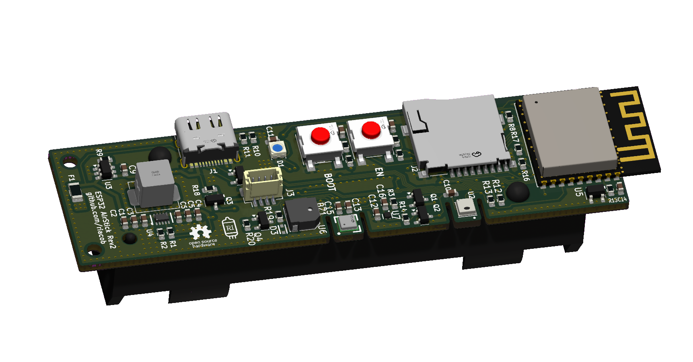

# ESP32 AirStick

The board is currently in Rev2

## Features
- AHT20 Temperature & Humidity Sensor
- ENS160 eCO2, AQI, TVOCs Sensor
- Measured TVOCs and their range:
  - Ethanol 0-6 ppm
  - Hydrogen 0-10 ppm
  - Acetone 0-32 ppm
  - Carbon Monoxide 0-90 ppm
  - Toluene 0-32 ppm
- 18650 Li-ion battery holder, TP4057 charging circuitry
- Battery protection with fuse and DW03
- USB Type-C with USB CDC for emulated UART and charging, ESD protected
- MicroSD TF card slot for data logging
- ESP32C3 For WiFi and BLE connectivity
- Still work in progress, compatible with [BLEMQTTPair]() app
- WS2812B led for indication and alarm
- Optional SSD1306 OLED 
- 75dB magnetic buzzer for alarm
- SparkFun Qwiic connector, in JST-SH 1.0mm pitch connector
- Optional connector to bring the rst and boot buttons to a remote front panel
- Low power, long life, high efficiency circuitry for optimized battery use
- Low BOM cost, consolidated parts, robust layout